<h1 align="left"> Hey there! I'm Akash 👋</h1>

<table>
  <tr>
    <td>
      <p align="left">
        Welcome to my GitHub profile! 😃
        <br> <br>
        I'm a passionate Cloud Engineer and Database Engineer with nearly 3 years of experience crafting scalable, efficient, and resilient cloud infrastructures. 
        I thrive on solving complex problems and turning ideas into powerful cloud solutions. 
        I'm always pushing the boundaries of what's possible. 
        <br> <br>
        Let's connect and build something amazing together!
      </p>
      <p align="left">
        
      </p>
    </td>
    <td>
      
    </td>
  </tr>
</table>

---


<h3 align="left">🚀 What I Bring to the Table</h3>

- **Deep Cloud Expertise:** Skilled in OCI, Oracle Database, AWS, Github Actions, Terraform and Oracle database. I'm experienced in creating robust, automated solutions for scalable cloud infrastructure.
- **Automation & Efficiency:** From CI/CD pipelines to Infrastructure as Code, I learning to optimizing workflows to improve efficiency and minimize downtime.
- **Mentorship & Collaboration:** I thrive in team environments and enjoy sharing knowledge, mentoring, and working together to tackle complex challenges in cloud or elsewhere.

---

- 📫 How to reach me **https://www.linkedin.com/in/akash-yy/**

---

---

### ⚡ Tech Stack

<div align="center">

<!-- ══ Cloud Platforms ══ -->


<!-- ══ IaC & CI/CD ══ -->


<!-- ══ Databases ══ -->


<!-- ══ Networking & Security ══ -->


<!-- ══ OS & Tooling ══ -->


<!-- ══ DB Tools ══ -->


</div>

---

### 🏗️ Recent Works

<div align="center">

</div>

---

### 🎮 Access My Resume — Terminal Mode

> **Hey Interviewer 👋** — drop into the cloud terminal below. Tiny infra workers are standing by. They're building VPCs, fixing IAM, deploying pipelines... and if something goes wrong, they'll personally page me.

```
┌─────────────────────────────────────────────────────────────────┐
│  akash@cloud-infra:~ — secure terminal  —  clearance: GUEST    │
│  [ VPC ] ──── [ IAM ] ──── [ CI/CD ] ──── [ Terraform ] ────  │
│    👷          👷             👷               👷               │
└─────────────────────────────────────────────────────────────────┘
```

**Commands available:**

| Command | What it does |
|---|---|
| `whoami` | Identity brief — who is Akash |
| `resume` | Fetch resume *(empty link → workers apologize & redirect to LinkedIn)* |
| `projects` | All infra projects with GitHub links |
| `skills` | Full tech stack breakdown |
| `experience` | Work history & impact |
| `contact` | Open a secure channel |

> ⚙️ **To configure the terminal** — update the top constants in the embedded script:
> ```js
> const RESUME_URL = "https://your-resume-link-here.pdf"; // leave "" to trigger the friendly error
> const PROJECTS   = [{ name:"...", url:"https://github.com/..." }]; // add real GitHub links
> const SKILLS     = [{ cat:"Cloud", items:["OCI","AWS","GCP"] }];  // edit your stack
> ```

<details>
<summary><b>🖥️ Preview: what the terminal reveals</b></summary>

```bash
akash@cloud ➜ resume

# — when RESUME_URL is set —
✔ fetching resume package...
→ https://your-resume-link.pdf
  ★ 22 on-prem DBs → Exadata@GCP
  ★ 300TB+ migrated, ~0 downtime

# — when RESUME_URL is empty —
!! ERROR 404 — resume package not found
tiny worker: "oh no.. the resume link is empty!"
tiny worker: "i'm so sorry... we're paging Akash right now!"
tiny worker: "please don't leave, he'll fix it soon i promise"
⚠ looks like the resume is under update.
→ https://www.linkedin.com/in/akash-yy/

─────────────────────────────────────

akash@cloud ➜ projects

PROJECT 001: Exadata@GCP Migration  ↗ github
  22 on-prem Oracle DBs migrated to Exadata@GCP
  stack : Oracle Exadata X8M · GCP · RMAN · Data Guard
  impact: 300TB+ migrated, ~0 downtime

PROJECT 002: OCI Hub-and-Spoke Network  ↗ github
  Enterprise multicloud connectivity fabric
  stack : VCN · DRG · FastConnect · Terraform

─────────────────────────────────────

akash@cloud ➜ unknown-command

!! tiny worker: "uhhh... i don't know that command... sorry!!"
!! tiny worker: "we're contacting Akash for help right now!"
try: help for available commands
```

</details>

---

<div align="center">

### 📡 Let's Connect

[](https://www.linkedin.com/in/akash-yy/)

*Open to discussing cloud architecture, database migrations, DevOps, and the next hard problem worth solving.*

</div>
