<h1 align="left"> Hey there! I'm Akash 👋</h1>

<table>
  <tr>
    <td>
      

        Welcome to my GitHub profile! 😃
           
        I’m a passionate Cloud Engineer and Database Engineer with nearly 3 years of experience crafting scalable, efficient, and resilient cloud infrastructures. 
        I thrive on solving complex problems and turning ideas into powerful cloud solutions. 
        Whether it’s Cloud Engineering, DevOps, or Site Reliability Engineering (SRE), I’m always pushing the boundaries of what’s possible. 
           
        Let’s connect and build something amazing together!
      

      

        
      

    </td>
    <td>
      
    </td>
  </tr>
</table>

---

<h3 align="left">🚀 What I Bring to the Table</h3>

- **Deep Cloud Expertise:** Skilled in OCI, Oracle Database, AWS, Github Actions and Terraform. I’m experienced in creating robust, automated solutions for scalable cloud infrastructure.
- **Automation & Efficiency:** From CI/CD pipelines to Infrastructure as Code, I learning to optimizing workflows to improve efficiency and minimize downtime.
- **Mentorship & Collaboration:** I thrive in team environments and enjoy sharing knowledge, mentoring, and working together to tackle complex challenges in cloud or elsewhere.

---

<!--
- 🔭 I’m currently working on [Terraform](https://github.com/nagarajurahul/Terraform)  and [CI-CD](https://github.com/nagarajurahul/CI-CD) 
-->

- 🌱 I’m currently dicing deep to achieve expertise in **Automation, AI integration, Security**

- 💬 Ask me about **Cloud**

- 📫 How to reach me **https://www.linkedin.com/in/akash-yy/**

---

<h3 align="left">🌐 Connect with Me</h3>

I'm always open to discussing cloud engineering, DevOps, SRE,DBA and exciting tech innovations. Feel free to reach out!

---

---

### ⚡ Tech Stack

---

### 🏗️ Recent Works

---

### 🌐 Skills at a Glance

| Layer | Technologies |
|---|---|
| ☁️ **Cloud** | OCI (Hub & Spoke, Compute, Networking, IAM, Storage) · AWS · GCP |
| 🏗️ **IaC & CI/CD** | Terraform · GitHub Actions · Git & GitHub |
| 🌐 **OCI Networking** | VCN · DRG · FastConnect · Multicloud Connectivity |
| 🔶 **AWS Services** | EC2 · VPC · RDS · IAM · Secrets Manager |
| 🗄️ **Databases** | Oracle DB · Exadata · OCI ATP · DBCS · EBS |
| 🔐 **Security** | IAM Policies · Vault · NSG · Least-Privilege Design |
| 🐧 **OS & Tooling** | Linux (Admin + Shell Scripting) · Bash · PowerShell |

---

### 📡 Let's Connect

*Open to discussing cloud architecture, database migrations, DevOps, and the next hard problem worth solving.*

